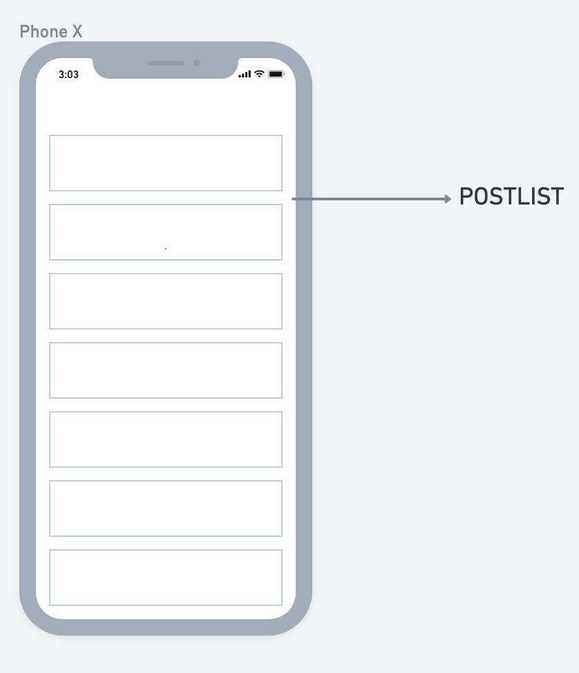
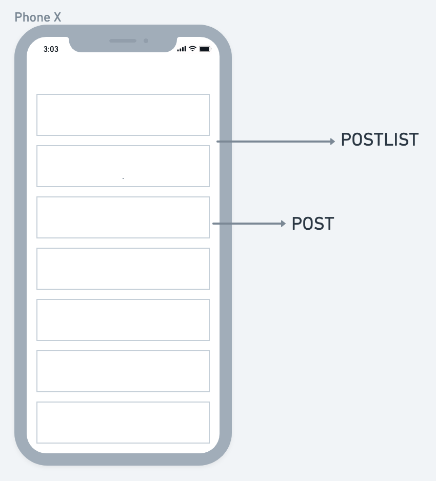

import { Head, Image, Appear } from 'mdx-deck'
import Code from 'mdx-code';
import { CodeSurfer } from "mdx-deck-code-surfer";

import { Cover } from './Cover';
import { Intro } from './Intro';
import { Img } from './Img';
import { Thanks } from './Thanks';
import { Feedback } from './Feedback';

export { default as theme } from './theme'

<Head>
  <title>Relay Hooks</title>
</Head>

<Cover />
---
<Intro />
---
# Overview

<ul>
    <Appear>
        <li>
            createQueryRenderModern
        </li>
        <li>
            QueryRenderer
        </li>
        <li>
            FragmentContainer
        </li>
        <li>
            Hooks
        </li>
    </Appear>
</ul>
---
## Why Relay

- declarative data
- data-fetching
- colocation

---
## Case

---
## Case

---
## Case

---
<CodeSurfer
  title="createQueryRenderer"
  code={require('!raw-loader!./code/createQueryRenderer.tsx')}
  showNumbers={false}
  dark={true}
  lang="jsx"
  steps={[
    { notes: "createQueryRenderer" },
    { range: [1,4], notes: 'props' },
    { range: [9, 10], notes: 'variables' },
    { range: [11, 26], notes: 'queryRenderer' },
  ]}
/>

---
<CodeSurfer
  title="PostList"
  code={require('!raw-loader!./code/PostList.tsx')}
  showNumbers={false}
  dark={true}
  lang="jsx"
  steps={[
    { notes: "PostList Component" },
    { range: [1, 4], notes: 'props' },
    { range: [5, 5], notes: 'variables' },
    { range: [11, 14], notes: 'handleSubmit' },
  ]}
/>

---
<CodeSurfer
  title="Post"
  code={require('!raw-loader!./code/Post.tsx')}
  showNumbers={false}
  dark={true}
  lang="jsx"
  steps={[
    { notes: "PostList Component" },
    { range: [1, 4], notes: 'props' },
    { range: [5, 5], notes: 'variables' },
    { range: [11, 14], notes: 'handleSubmit' },
  ]}
/>

---

## Relay Hooks
<ul>
    <li>
        RelayEnvironmentProvider
    </li>
    <li>
        useRelayEnvironment
    </li>
    <li>
        usePreloadedQuery
    </li>
    <li>
        useLazyLoadQuery
    </li>
    <li>
        useFragment
    </li>
    <li>
        useRefetchableFragment
    </li>
    <li>
        usePaginationFragment
    </li>
</ul>

---
## Benefits and Caveats
<ul>
    <Appear>
        <li>
            Simple Code
        </li>
        <li>
            React Concurrency Mode and Suspense
        </li>
        <li>
            APIS uncomplication
        </li>
        <li>
            Opposed to HOCs
        </li>
    </Appear>
</ul>

---
<CodeSurfer
  title="RelayEnvironmentProvider"
  code={require('!raw-loader!./code/hooks/RelayEnvironmentProvider.tsx')}
  showNumbers={false}
  dark={true}
  lang="jsx"
  steps={[
    { notes: "RelayEnvironmentProvider will wrap our app setting the environment on React Context" },
  ]}
/>

---
<CodeSurfer
  title="useRelayEnvironment"
  code={require('!raw-loader!./code/hooks/useRelayEnvironment.tsx')}
  showNumbers={false}
  dark={true}
  lang="jsx"
  steps={[
    { notes: "Hook used to access a Relay environment that was set by a RelayEnvironmentProvider" },
  ]}
/>

---
<CodeSurfer
  title="usePreloadedQuery"
  code={require('!raw-loader!./code/hooks/usePreloadedQuery.tsx')}
  showNumbers={false}
  dark={true}
  lang="jsx"
  steps={[
    { notes: "Hook used to access data fetched by an earlier call to preloadQuery()." },
    { notes: "This implements the 'Render-as-You-Fetch' pattern" }
  ]}
/>

---
<CodeSurfer
  title="useLazyLoadQuery"
  code={require('!raw-loader!./code/hooks/useLazyLoadQuery.tsx')}
  showNumbers={false}
  dark={true}
  lang="jsx"
  steps={[
    { notes: "Hook used to fetch a GraphQL query during render." },
  ]}
/>

---
<CodeSurfer
  title="useFragment"
  code={require('!raw-loader!./code/hooks/useFragment.tsx')}
  showNumbers={false}
  dark={true}
  lang="jsx"
  steps={[
    { notes: "Hook used to fetch a GraphQL query during render." },
  ]}
/>

---
<CodeSurfer
  title="useRefetchableFragment"
  code={require('!raw-loader!./code/hooks/useRefetchableFragment.tsx')}
  showNumbers={false}
  dark={true}
  lang="jsx"
  steps={[
    { notes: "You can use useRefetchableFragment when you want to fetch and re-render a fragment with different data" },
  ]}
/>

---
<CodeSurfer
  title="usePaginationFragment"
  code={require('!raw-loader!./code/hooks/usePaginationFragment.tsx')}
  showNumbers={false}
  dark={true}
  lang="jsx"
  steps={[
    { notes: "You can use useRefetchableFragment when you want to fetch and re-render a fragment with different data" },
  ]}
/>

---
<Thanks />
---
<Feedback />